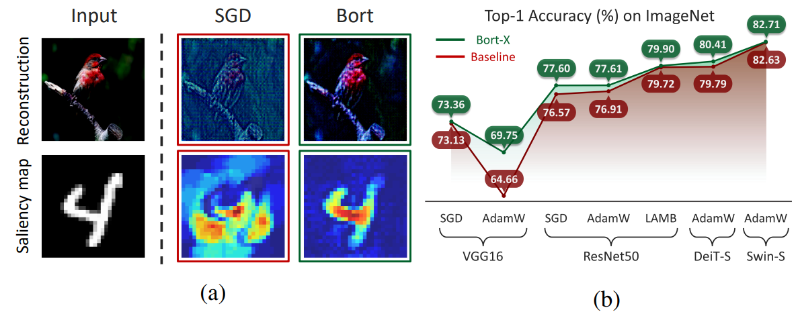
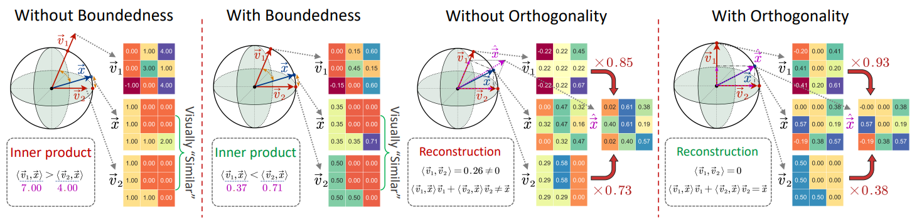

# Bort

**[ICLR 2023]** Official PyTorch implementation for ["Bort: Towards Explainable Neural Networks with Bounded Orthogonal Constraint"](https://arxiv.org/abs/2212.09062).



This paper proposes **Bort**, an optimizer for improving model explainability with boundedness and orthogonality constraints on model parameters, derived from the sufficient conditions of model comprehensibility and invertibility.



## Installation Guide

```bash
pip install -e .
```

## Citation

If you find this work helpful, please cite our paper:
```bibtex
@inproceedings{zhang2023bort,
  title={Bort: Towards Explainable Neural Networks with Bounded Orthogonal Constraint},
  author={Zhang, Borui and Zheng, Wenzhao and Zhou, Jie and Lu, Jiwen},
  booktitle={The Eleventh International Conference on Learning Representations},
  year={2023}
}
```